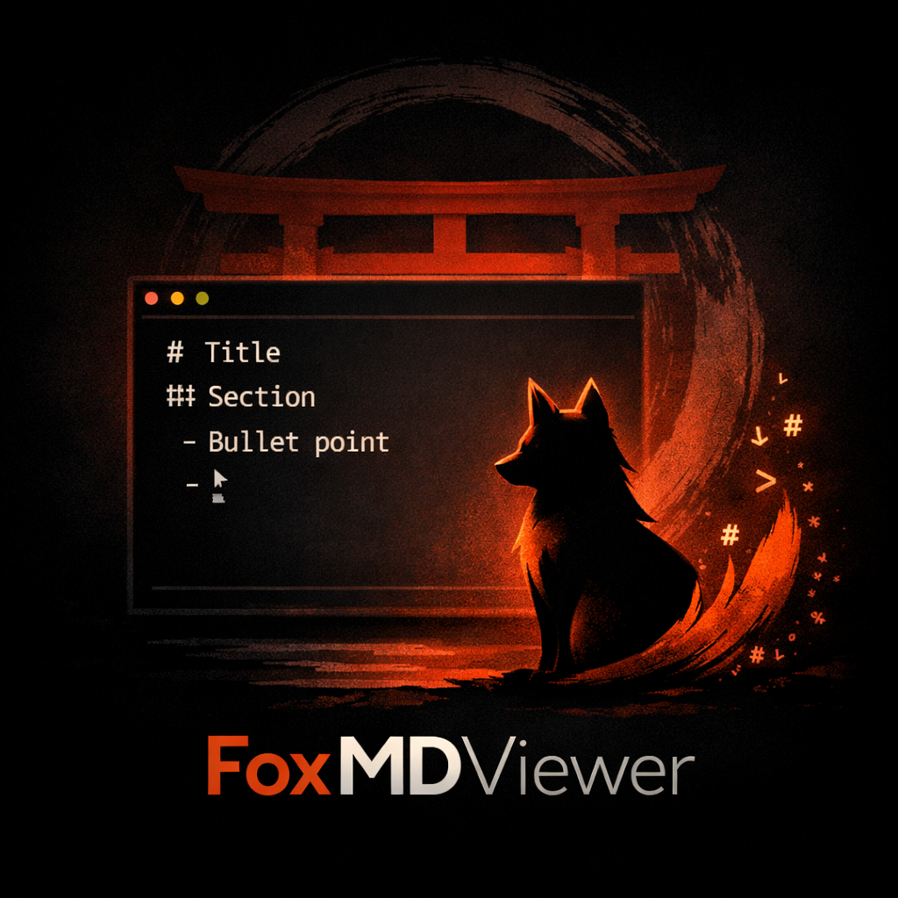

<p align="center">
  
</p>

<h1 align="center">FoxMDViewer 🦊⛩️</h1>

<p align="center">
  A beautiful, fast, and feature-rich markdown viewer with a Shinto-inspired theme.
</p>

<p align="center">
  <a href="#installation">Installation</a> •
  <a href="#usage">Usage</a> •
  <a href="#features">Features</a> •
  <a href="#development">Development</a>
</p>

---

## Installation

### From Source (Development)

```bash
cd /home/anderson/Documentos/Coding/mdviewer
python -m venv venv
source venv/bin/activate
pip install -e .
```

### From Git

```bash
pip install git+https://github.com/AndersonFirmino/FoxMDViewer.git
```

## Usage

```bash
# Start in current directory
mdv

# Start in specific directory
mdv /path/to/documents

# Use specific port
mdv --port 8080

# Don't open browser
mdv --no-browser

# Debug mode
mdv --debug
```

### Command Line Options

```
Usage: mdv [OPTIONS] [DIRECTORY]

Options:
  -p, --port INTEGER     Port to run server on (default: auto-detect)
  -h, --host TEXT        Host to bind server to (default: 127.0.0.1)
  --no-browser           Do not open browser automatically
  --debug                Enable debug mode with auto-reload
  --version              Show version and exit
  --help                 Show this message and exit
```

## Features

✨ **Auto-detection**: Automatically scans directories for markdown files  
🎨 **Beautiful UI**: Modern, responsive interface with Shinto theme (dark/light)  
⚡ **Real-time Updates**: Live file watching with WebSocket updates  
🔍 **Search**: Full-text search across all markdown files  
✏️ **Inline Editor**: Edit markdown files directly in the browser  
📦 **Cache**: Intelligent HTML caching for fast rendering  
🦊 **Kitsune Mode**: Optional easter eggs via settings panel  
⛩️ **Torii Theme**: Beautiful Japanese-inspired design  

## Development

### Running Tests

```bash
pip install -e ".[dev]"
pytest tests/
```

### Project Structure

```
foxmdviewer/
├── cli.py                # Command line interface
├── main.py               # Starlette application
├── config.py             # Configuration
├── api/                  # REST API and WebSocket
├── services/             # Business logic
├── models/               # Pydantic models
├── utils/                # Utilities
├── middleware/           # Middleware components
├── templates/            # HTML templates
└── static/               # CSS/JS assets
```

## Configuration

Environment variables with `FOXMDVIEWER_` prefix:

```bash
export FOXMDVIEWER_HOST=127.0.0.1
export FOXMDVIEWER_PORT=8080
export FOXMDVIEWER_DEBUG=true
export FOXMDVIEWER_AUTO_OPEN_BROWSER=true
export FOXMDVIEWER_CACHE_ENABLED=true
```

## License

MIT License

## Author

Created by Anderson

---

Happy reading! 📚✨
